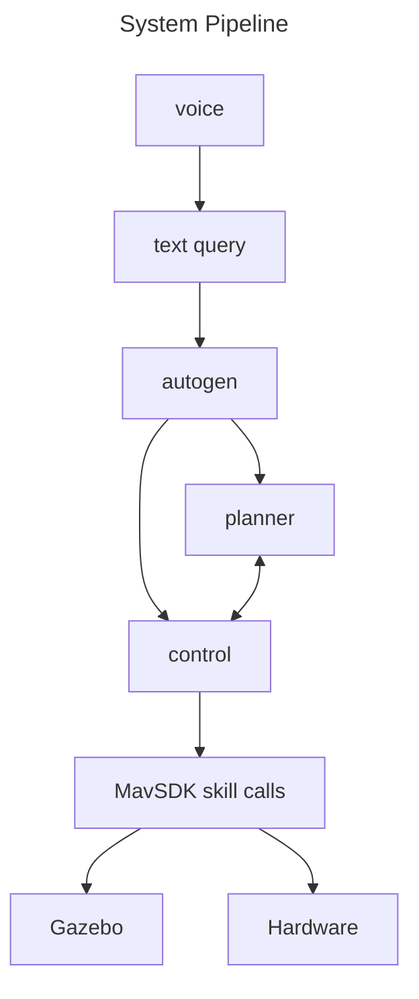

# Embodied Drone Agents

Welcome to the Embodied Drone Agents project! This repository contains code for creating embodied AI-driven drone agents using the AutoGen framework and MavSDK. Our goal is to enable the conversion of language prompts into parameterized function calls to control drone behavior programmatically.

## Table of Contents

- [Introduction](#introduction)
- [System Information](#system-information)
- [Features](#features)
- [Installation](#installation)
- [Usage](#usage)
- [Examples](#example-prompts)
- [Contributing](#contributing)
- [To-Do](#to-do)
- [Acknowledgements](#acknowledgements)

## Introduction

Embodied Drone Agents is a project focused on developing embodied AI agents in drones that can understand and execute complex tasks based on natural language instructions. By leveraging AutoGen for language processing and MavSDK for drone control, we aim to create a seamless interface for drone operation.

Currently, the repository has two main directories, InitialAgent-D and Agent-Drone. InitialAgent-D was our first attempt at using a single Autogen agent to accomplish autonomous programmatic control over the drone. The working project is located in the Agent-Drone directory. It can be run by activating a virtual environment, installing all the requirements found in requirements.txt, and running Agent-Drone/main.py.

**Project demo video**
[](https://youtu.be/NRuVsO5KgGA)


## System Information
This project relies on the following technologies:
- Ubuntu 22.04 LTS
- Windows Subsystem for Linux (when developing on Windows computer)
- PX4
- Python 3.9+
- MavSDK Python package
- Gazebo PX4 shell (make px4_sitl gazebo)
- Other Python package requirements

*Read more about software dependencies in the set up section*

The hardware our project uses is the HolyBro x500 Drone


## Features

- **Language to Action**: Convert natural language prompts into parameterized function calls.
- **Hierarchial Agent Structure**: Use of high-level planner LLM and executor agent that communicate with each other in order to achieve desired complex behavior.
- **Drone Control**: Utilize MavSDK to control various aspects of drone behavior.
- **Extensibility**: Easily add new commands and behaviors through modular design.
- **Voice capability**: Users can input either voice or text queries into the agent system.

### Skills & Prompting
Found in Agent-Drone/agent_d/skills/ are various python scripts that are skills the agent can use to move the drone. The scripts all use Python's MavSDK package. The planner LLM agent has knowledge about what skills can be executed, and the control agent has power only to execute the skills. 

Accessible skills: **takeoff, land, circle a point, fly to coordinates, hover at location, return to launch, & rotate to specific yaw**

To-Be Implemented skills: **follow me, got objects, & get poses**

Prompts.py found in Agent-Drone/agent_d/ is crucial to the Autogen agent system for understanding what their roles are. Prompts.py contains prompts for the agents and for each skill, outlining what each component means. Furthermore, Autogen understands the parameters and return types of external functions via the Python package Annotated from the typing library. Each of our skills' functions are annotated.

## Installation

To get started with the Embodied Drone Agents project, it's important to determine the type of computer that you own and what your goals are with respect to the use of this project. This project is not compatible with Apple devices. You must use either a Windows or Ubuntu Linux machine. Follow these steps:

1. **Clone the repository:**
   ```bash
   git clone https://github.com/EmergenceAI/embodied-drone-agents.git
   cd embodied-drone-agents
   ```

2. **Install dependencies:**
   Ensure you have Python 3.8+ installed. Then, install the required Python packages:
   ```bash
   pip install -r requirements.txt
   ```

3. **Setup MavSDK:**
   Follow the [MavSDK installation guide](https://mavsdk.mavlink.io/main/en/getting_started/installation.html) to install MavSDK.

4. **Setup for Windows:**

   a. Setup Ubuntu Subsystem:
      - Open Windows Powershell as Admin
      - Run the following commands:
        ```
        dism.exe /online /enable-feature /featurename:Microsoft-Windows-Subsystem-Linux /all /norestart
        dism.exe /online /enable-feature /featurename:VirtualMachinePlatform /all /norestart
        wsl --set-default-version 2
        ```
      - Install Ubuntu 22.04 via the Microsoft Store
      - Run: `wsl --install`
      - In the Ubuntu terminal, run:
        ```
        sudo apt update
        sudo apt upgrade
        ```

   b. Setup PX4:
      ```
      cd
      git clone https://github.com/PX4/PX4-Autopilot.git --recursive
      bash ./PX4-Autopilot/Tools/setup/ubuntu.sh
      # Close terminal and reopen terminal
      cd PX4-Autopilot/
      make px4_sitl
      ```

   c. Setup MAVSDK:
      ```
      cd ..
      sudo apt update
      sudo apt install -y git cmake build-essential libboost-system-dev libeigen3-dev libopencv-dev
      git clone https://github.com/mavlink/MAVSDK.git
      cd MAVSDK
      pip install mavsdk
      cd ..
      ```

   d. Setup Gazebo:
      ```
      sudo apt install gazebo
      cd ~/PX4-Autopilot/
      ```
      Setup environment:
      First, check if setup_gazebo.bash exists by looking through the full PX4-Autopilot directory, as it may be in a different location. Check within both ~/PX4-Autopilot/Tools/ and ~/PX4-Autopilot/Tools/simulation/gazebo-classic/ for setup_gazebo.bash.
      If setup_gazebo.bash exists already, then note the full path where it exists and jump directly to step 'e'. If it doesn't exist, then create it using the following steps and skip step 'e':
      ```
      cd ~/PX4-Autopilot/Tools
      nano setup_gazebo.bash
      ```
      Use the following code within the bash file:
      ```
      #!/bin/bash

      # Set Gazebo plugin path
      export GAZEBO_PLUGIN_PATH=$GAZEBO_PLUGIN_PATH:~/PX4-Autopilot/build/px4_sitl_default/build_gazebo

      # Set Gazebo model path
      export GAZEBO_MODEL_PATH=$GAZEBO_MODEL_PATH:~/PX4-Autopilot/Tools/sitl_gazebo/models

      # Set library path
      export LD_LIBRARY_PATH=$LD_LIBRARY_PATH:/usr/local/lib

      # Set ROS package path
      export ROS_PACKAGE_PATH=$ROS_PACKAGE_PATH:~/PX4-Autopilot:~/PX4-Autopilot/Tools/sitl_gazebo
      ```
      Save and exit (Ctrl+O, Enter, Ctrl+X)
      ```
      chmod +x setup_gazebo.bash
      nano ~/.bashrc
      ```
      Add these lines to the end of the file:
      ```
      source ~/PX4-Autopilot/Tools/setup_gazebo.bash ~/PX4-Autopilot ~/PX4-Autopilot/build/px4_sitl_default
      export ROS_PACKAGE_PATH=$ROS_PACKAGE_PATH:~/PX4-Autopilot:~/PX4-Autopilot/Tools/sitl_gazebo
      ```
      Save and exit (Ctrl+O, Enter, Ctrl+X)
      ```
      source ~/.bashrc
      ```

   e. Choose the option that best matches your project structure and contains the correct directories for setup_gazebo.bash and sitl_gazebo on your machine. Then, add the appropriate lines to the end of your /.bashrc file:
      ```
      nano ~/.bashrc
      ```
      Option 1:
      ```
      source ~/PX4-Autopilot/Tools/simulation/gazebo-classic/setup_gazebo.bash ~/PX4-Autopilot ~/PX4-Autopilot/build/px4_sitl_default
      export ROS_PACKAGE_PATH=$ROS_PACKAGE_PATH:~/PX4-Autopilot:~/PX4-Autopilot/Tools/simulation/gazebo-classic/sitl_gazebo-classic
      ```
      Option 2:
      ```
      source ~/PX4-Autopilot/Tools/setup_gazebo.bash ~/PX4-Autopilot ~/PX4-Autopilot/build/px4_sitl_default
      export ROS_PACKAGE_PATH=$ROS_PACKAGE_PATH:~/PX4-Autopilot:~/PX4-Autopilot/Tools/sitl_gazebo
      ```
      Option 3:
      ```
      source ~/PX4-Autopilot/PathToBashFile/setup_gazebo.bash ~/PX4-Autopilot ~/PX4-Autopilot/build/px4_sitl_default
      export ROS_PACKAGE_PATH=$ROS_PACKAGE_PATH:~/PX4-Autopilot:~/PX4-Autopilot/PathToGazeboFile/sitl_gazebo
      ```
      Save and exit (Ctrl+O, Enter, Ctrl+X)
      ```
      source ~/.bashrc
      ```

   f. Run Gazebo:
      ```
      make px4_sitl gazebo
      ```

6. **Setup for Linux (Ubuntu):**

   a. Open an Ubuntu terminal and run:
      ```
      sudo apt update
      sudo apt upgrade
      ```

   b. Setup PX4:
      ```
      cd
      git clone https://github.com/PX4/PX4-Autopilot.git --recursive
      bash ./PX4-Autopilot/Tools/setup/ubuntu.sh
      # Close terminal and reopen terminal
      cd PX4-Autopilot/
      make px4_sitl
      ```

   c. Setup MAVSDK:
      ```
      cd ..
      sudo apt update
      sudo apt install -y git cmake build-essential libboost-system-dev libeigen3-dev libopencv-dev
      git clone https://github.com/mavlink/MAVSDK.git
      cd MAVSDK
      pip install mavsdk
      cd ..
      ```

   d. Setup Gazebo:
      Follow the same Gazebo setup steps as in the Windows instructions above.

   e. Run Gazebo:
      ```
      make px4_sitl gazebo
      ```

7. **Start mavsdk_server:**
   Open a new terminal (making sure to keep the Gazebo terminal open) and run:
   ```
   mavsdk_server udp://:14540
   ```

## Usage

### Windows
1. **Start Gazebo**

   a. Open Powershell and click "run as administrator":

   b. Launch WSL:
      ```
      wsl --install
      ```

   c. Launch Gazebo:
      ```
      cd PX4-Autopilot/
      make px4_sitl gazebo
      ```
2. **Start MavSDK server**

   a. Open Powershell and click "run as administrator":

   b. Launch WSL:
      ```
      wsl --install
      ```

   c. Start server at port:
      ```
      mavsdk_server udp://:14540
      ```

3. **Run Repo Code**

   a. Open Powershell and click "run as administrator":

   b. Launch WSL:
      ```
      wsl --install
      ```

   c. Mount local files:
      ```
      cd /mnt/[path/to/this/github/repo/]
      ```

   d. Run main.py
      ```
      cd /Agent-Drone/
      python3 main.py
      ```

When running this project, you should have 2 terminals open for the Gazebo server and MavSDK server, and another terminal open to run main.py (3 terminals). You should be able to provide natural language queries to control the drone in the Gazebo simulator. Check out the [Examples](#example-prompts) section below for test prompts to query into the agent system.

You can customize the behavior by modifying the configuration files and scripts provided in the `config` and `scripts` directories.

## Example Prompts

After running main.py, you will be prompted to enter a query for the drone. Here are some example queries to enter.

1. **Takeoff and Land:**
   Take off to a height of 10m, and then come back down

2. **Fly to a Specific Location:**
   Fly to coordinates 10, 8, 6. Then, fly to the origin.

3. **Complex Multi-Step Tasks:**
   Takeoff to 12 meters, go to 2, 6 at that same altitude, then go left, then in a circle, and then land back where you took off from.

## Contributing

We welcome contributions to the Embodied Drone Agents project! If you have any improvements or new features to add, please follow these steps:

1. **Fork the repository.**
2. **Create a new branch:** `git checkout -b feature-branch`
3. **Commit your changes:** `git commit -m 'Add new feature'`
4. **Push to the branch:** `git push origin feature-branch`
5. **Create a pull request.**

Please ensure your code follows the project's coding standards and includes appropriate tests.

## To-Do

### Voice enablement
Currently, the script "voice_to_text.py" in the InitialAgentD directory gets a voice recording through a GUI and transcribes it into text. This voice -> text script needs to be integrated with the AgentD project to create an end-to-end voice-to-drone movement system. The entire pipeline should look like this:



### Autogen State Input
One of our primary goals was to find a way to feed the state of the Gazebo simulator as information into the agent system. In our skills, we have an example get_objects() skill that has yet to be implemented. We were unable to get pygazebo and gz transport libraries working, so we couldn't get object data from gazebo simulator. Currently, in Agent-Drone/agent_d/skills/, we have scripts get_objects.py and get_poses.sh. Both of these scripts were unsuccessful attempts to extract the information of objects in the simulators. 

In order to implement this, we recommend trying to get the skill get_objects.py working so that it gets formatted data of the objects in the simulator and simply adds it as a skill in drone_control_agent.py. When adding it as a skill, be sure to register it for both the LLM and executor.

### Drone Hardware
We are having some difficulty with getting the drone hardware to pass pre-flight checks. We need to demonstrate basic programmatic control of the drone and then simply use the autogen system.

## Acknowledgements

We would like to thank the following individuals and organizations for their invaluable contributions as we developed this project.
- **Aniketh Arvind** & **Mihir Kulshreshtha**, developers
- **Ashish Jagmohan**, primary supervisor
- **Tamer Abuelsaad, Aditya Vempaty, Deepak Akkil, & Ravi Kokku** technical advisors
- [**Emergence AI**](https://www.emergence.ai/), AI agent company
