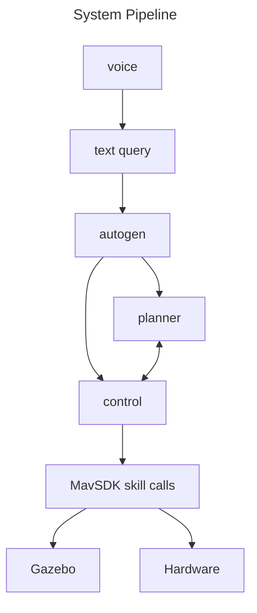

# Embodied Drone Agents

Welcome to the Embodied Drone Agents project! This repository contains code for creating embodied AI-driven drone agents using the AutoGen framework and MavSDK. Our goal is to enable the conversion of language prompts into parameterized function calls to control drone behavior programmatically.

## Table of Contents

- [Introduction](#introduction)
- [System Information](#system-information)
- [Features](#features)
- [Installation](#installation)
- [Usage](#usage)
- [Examples](#example-prompts)
- [Contributing](#contributing)
- [To-Do](#to-do)
- [Acknowledgements](#acknowledgements)

## Introduction

Embodied Drone Agents is a project focused on developing embodied AI agents in drones that can understand and execute complex tasks based on natural language instructions. By leveraging AutoGen for language processing and MavSDK for drone control, we aim to create a seamless interface for drone operation.

**Project demo video**
[](https://youtu.be/NRuVsO5KgGA)


## System Information
This project relies on the following technologies:
- Ubuntu 22.04 LTS
- Windows Subsystem for Linux (when developing on Windows computer)
- PX4
- Python 3.9+
- MavSDK Python package
- Gazebo PX4 shell (make px4_sitl gazebo)
- Other Python package requirements

*Read more about software dependencies in the set up section*

The hardware our project uses is the HolyBro x500 Drone


## Features

- **Language to Action**: Convert natural language prompts into parameterized function calls.
- **Hierarchial Agent Structure**: Use of high-level planner LLM and executor agent that communicate with each other in order to achieve desired complex behavior.
- **Drone Control**: Utilize MavSDK to control various aspects of drone behavior.
- **Extensibility**: Easily add new commands and behaviors through modular design.
- **Voice capability**: Users can input either voice or text queries into the agent system.

## Installation

To get started with the Embodied Drone Agents project, follow these steps:

1. **Clone the repository:**
   ```bash
   git clone https://github.com/EmergenceAI/embodied-drone-agents.git
   cd embodied-drone-agents
   ```

2. **Install dependencies:**
   Ensure you have Python 3.8+ installed. Then, install the required Python packages:
   ```bash
   pip install -r requirements.txt
   ```

3. **Setup MavSDK:**
   Follow the [MavSDK installation guide](https://mavsdk.mavlink.io/main/en/getting_started/installation.html) to install MavSDK.

## Usage

To use the Embodied Drone Agents, you can run the main script and provide language prompts to control the drone:

```bash
python main.py
```

You can customize the behavior by modifying the configuration files and scripts provided in the `config` and `scripts` directories.

## Example Prompts

After running main.py, you will be prompted to enter a query for the drone. Here are example queries to enter.

1. **Takeoff and Land:**
   Take off to a height of 10m, and then come back down

2. **Fly to a Specific Location:**
   Fly to coordinates 10, 8, 6. Then, fly to the origin.

3. **Complex Multi-Step Tasks:**
   Fly up, to the left, to the right, and then in a circle

## Contributing

We welcome contributions to the Embodied Drone Agents project! If you have any improvements or new features to add, please follow these steps:

1. **Fork the repository.**
2. **Create a new branch:** `git checkout -b feature-branch`
3. **Commit your changes:** `git commit -m 'Add new feature'`
4. **Push to the branch:** `git push origin feature-branch`
5. **Create a pull request.**

Please ensure your code follows the project's coding standards and includes appropriate tests.

## To-Do

### Voice enablement
Currently, the script "voice_to_text.py" in the InitialAgentD directory get a voice recording through a GUI and transcribes it into text. This voice -> text script needs to be integrated with the AgentD project to create a end-to-end voice to drone movement system. The entire pipeline should look like this:



### Autogen State Input
One of our primary goals was to find a way to feed in the state of the Gazebo simulator as information into the agent system. In our skills, we have an example get_objects() skill that has yet to be implemented. We were unable to get pygazebo and gz transport libraries working, so we couldn't get object data from gazebo simulator. Currently, in Agent-Drone/agent_d/skills/ we have scripts get_objects.py and get_poses.sh. Both of these scripts were unsuccessful attempts to extract the information of objects in the simulators. 

In order to implement this, we recommend to try to get the skill get_objects.py working so that it gets formatted data of the objects in the simulator, and simply add it as a skill in drone_control_agent.py. When adding it as a skill, be sure to register it for both the LLM and executor.

### Drone Hardware
Having difficulty with getting hardware drone to pass pre-flight checks. Need to demonstrate basic programmatic control of the drone, and then simply use the autogen system.

## Acknowledgements

We would like to thank the following individuals and organizations for their invaluable contributions as we developed this project.
- **Aniketh Arvind** & **Mihir Kulshreshtha**, developers
- **Ashish Jagmohan**, primary supervisor
- **Tamer Abuelsaad**, technical advisor
- **Aditya Vempaty**, technical advisor
- **Deepak Akkil**, technical advisor
- **Ravi Kokku**, technical advisor
- **Emergence AI**, AI agent company
